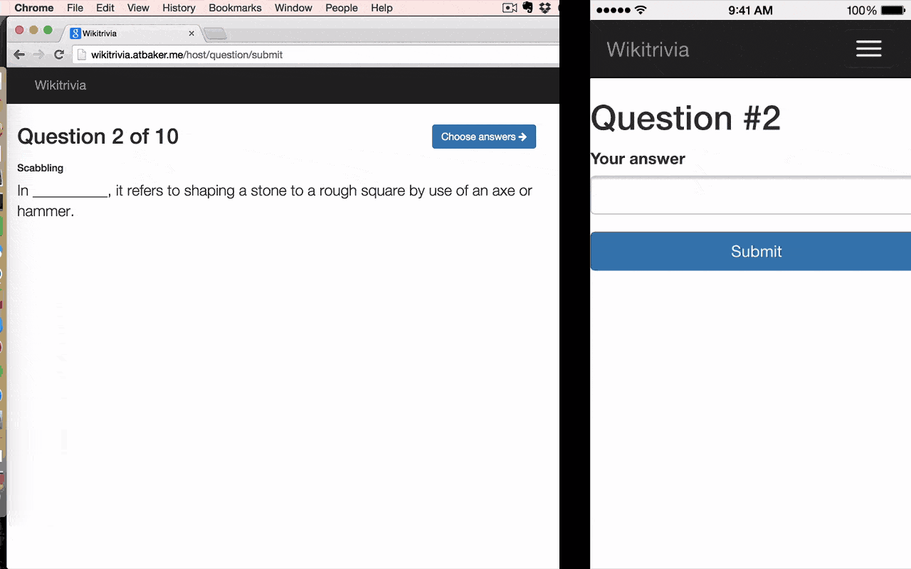

Wikitrivia
==========

    

Wikitrivia is a game where you fill in the blanks in sentences pulled from Wikipedia articles, trying to fool your friends with the most convincing answer.

**Play it yourself at [http://wikitrivia.atbaker.me/](http://wikitrivia.atbaker.me/).**

It was created for the Natural Language Processing edition of the DC [Monthly Challenge](http://www.meetup.com/TrackMaven-Monthly-Challenge/events/218683569/) meetup. You can learn more about Wikitrivia in [this presentation](http://slides.com/atbaker/trackmaven-monthly-challenge-demo).

Questions are generated from Wikipedia articles using a companion Python script, [wikipedia-question-generator](https://github.com/atbaker/wikipedia-question-generator).

Wikitrivia was created by [Andrew T. Baker](http://andrewtorkbaker.com/) in December 2014. It is open source under the [Apache 2.0 License](LICENSE).

How to play
-----------

To play Wikitrivia, you will need one computer in a place where everyone can see it (connected to a TV is ideal). Each player will then connect to the game with their smartphone.

Wikitrivia is still in alpha, but it is possible to play an entire game. You'll get the hang of how to play once you answer a couple questions.

### Known issues

Players must not let their phones go to sleep while playing. There is no easy way to rejoin a game that is in progress.

Quickstart
----------

Wikitrivia was built using [Docker](https://www.docker.com/), so I recommend using it to run Wikitrivia locally and in the cloud.

1. Install Docker and [docker-compose](https://docs.docker.com/compose/)
1. Clone this repository and `cd` into it
1. Run `docker-compose up -d` to start the `node` and `db` services

You should then be able to access Wikitrivia locally (or at `boot2docker ip`, if you're on OS X or Windows).

To load question data into Wikitrivia, run `docker-compose run node npm run-script load data/default.json`. Replace `data/default.json` with a path to your own question data if you generated some from [wikipedia-question-generator](https://github.com/atbaker/wikipedia-question-generator).

After that you're ready to play! Your computer will need to be somewhat exposed to the world for other players to connect on their mobile devices. Tools like [ngrok](https://ngrok.com/) can help with that.

Architecture
------------

Wikitrivia is built using a conventional [MEAN stack](http://mean.io/). It relies heavily on websockets to keep the host and player browsers in sync.
